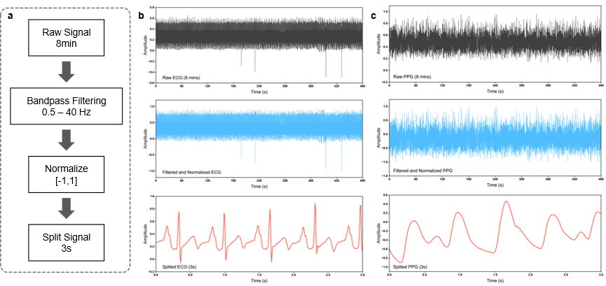
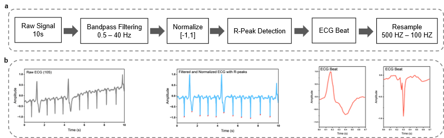

<div align="center">
  <div>
    <h1>
        A universal deep learning framework for clinical-grade ECG reconstruction from wrist pulse waves enabling continuous cardiovascular monitoring
    </h1>
  </div>

  <div>
    Chan Ye</strong>,  
    Yixiao Li</strong></a>,
    Yi Wang,
    Xiaoqian Dong,
    Kun Zheng, 
    Yutao Song, 
    Yuxin Gao, 
    Yinglong Duan, 
    Jianfei Xie, 
    Lei Liao, 
    and Rong Yang1   
  </div>

  <br/>
  <br/>
</div>

---

Wearable electrocardiogram (ECG) devices are essential for detecting intermittent cardiac anomalies but are fundamentally hindered by anatomical constraints: thoracic placement suffers from user discomfort and adhesive failure over long-term wear, whereas active dual-point contact fails to provide continuous, passive monitoring. Single-point pulse wave (PW) sensing offers a continuous, passive alternative. However, decoding the non-linear PW-to-ECG mapping is severely limited by generalization failures when models encounter diverse real-world cohorts. Here, we report PulseGUARD, a wrist-worn system that reconstructs full-waveform ECGs from single-point PWs using a subject-adaptive generative adversarial network, enabling real-time cardiac monitoring and early warning across diverse daily activities. The system achieves a reconstruction fidelity of 0.83 (Pearson correlation coefficient) and an arrhythmia classification accuracy of 98.17% across 65 subjects. Furthermore, the framework demonstrates robust generalization across diverse commercial sensors. This transferable capability is clinically validated by successfully detecting cardiac anomalies in patients using off-the-shelf devices. To our knowledge, this establishes a scalable paradigm for adaptable cardiovascular screening across diverse sensors.

The official implementation codes are here.


---

## 🔧 Requirements

Install dependencies:

```bash
pip install -r requirements.txt
```


---

## 📂 Dataset Preparation

### BIDMC 

Download from [BIDMC ](https://www.physionet.org/content/bidmc/1.0.0/#files-panel).


### PTBXL

Download from [PTBXL](https://physionet.org/content/ptb-xl/1.0.3/).


---

## 🚀 data processing

### BIDMC 
As the raw physiological signals contain a varying amounts and types of noise (e.g. power line interference, baseline wandering, motion artefacts), we perform very common filtering techniques on both the ECG and PW signals. We apply a band-pass FIR filter with a pass-band frequency of 0.5 Hz and stop-band frequency of 40 Hz on the ECG signals. Similarly, a Band-pass Butterworth filter with a pass-band frequency of 1 Hz and a stopband frequency of 8 Hz is applied on the PW signals. Next, person-specific z-score normalization is performed on both ECG and PW. Then, the normalized ECG and PW signals are segmented into 3-second windows (125 Hz × 3 seconds = 375 samples), with a 10% overlap to avoid missing any peaks. Finally, we perform min-max [−1, 1] normalization on both ECG and PW segments to ensure all the input data are in a specific range.



### PTBXL
For the collected data, all reconstructed ECG signals were normalized to address amplitude scaling and eliminate baseline shifts. R-peaks were then detected for segmentation, excluding the first and last beats. Each ECG beat, consisting of 500 samples (200 samples before and 300 samples after the R-peak), was subsequently fed into the pretrained CNN for testing.



---

## 🧠 Pre-train GAN Model

The GAN model was trained on the BIDMC dataset using a single Nvidia RTX 3090 GPU. The training procedure spanned 500 epochs, requiring approximately 5 to 6 hours for completion.

```bash
PulseGUARD/model/best_generator_mse.h5
```

---

## 🧩 Fine-tuning Model

To adapt the pretrained model to our in-house dataset, we fine-tune the model using the in-house dataset. 


---

## 📬 Contact

If you encounter issues or wish to discuss collaborations, please contact **Chan Ye**(yechan@hnu.edu.cn) or **Yixiao Li**(liyixiao@hnu.edu.cn).

