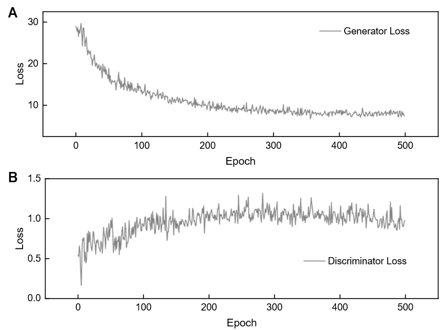
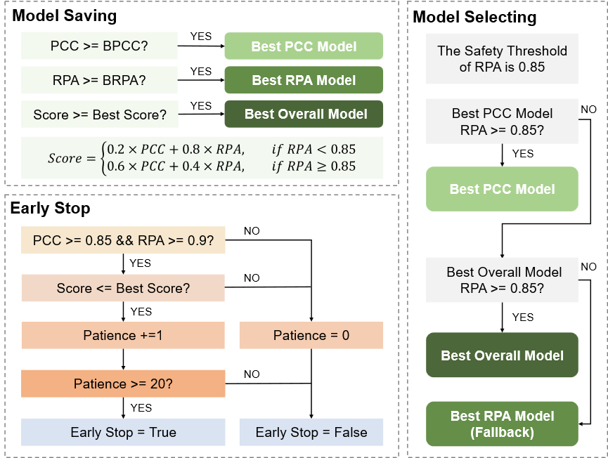

PulseGUARD -- Adaptive reconstruction of clinical-grade electrocardiograms from wrist pulse waves for continuous cardiovascular monitoring

1、Public dataset : BIDMC PPG and Respiration Dataset
https://www.physionet.org/content/bidmc/1.0.0/#files-panel

2、data preprocessing
As the raw physiological signals contain a varying amounts and types of noise (e.g. power line interference, baseline wandering, motion artefacts), we perform very common filtering techniques on both the ECG and PW signals. We apply a band-pass FIR filter with a pass-band frequency of 0.5 Hz and stop-band frequency of 40 Hz on the ECG signals. Similarly, a Band-pass Butterworth filter with a pass-band frequency of 1 Hz and a stopband frequency of 8 Hz is applied on the PW signals. Next, person-specific z-score normalization is performed on both ECG and PW. Then, the normalized ECG and PW signals are segmented into 3-second windows (125 Hz × 3 seconds = 375 samples), with a 10% overlap to avoid missing any peaks. Finally, we perform min-max [−1, 1] normalization on both ECG and PW segments to ensure all the input data are in a specific range

3、pre-trained GAN
The GAN model was trained on the BIDMC dataset using a single Nvidia RTX 3090 GPU. The training procedure spanned 500 epochs, requiring approximately 5 to 6 hours for completion. We monitored the training stability through the adversarial losses:
(1) Generator Loss: Demonstrated a sharp initial decay followed by stabilization, reflecting the model's rapid acquisition of morphological features .
(2) Discriminator Loss: Gradually increased and converged to a steady state, indicating the establishment of a Nash Equilibrium between the generator and discriminator . 
By the 500th epoch, both losses stabilized without signs of mode collapse, confirming that the allocated training duration was sufficient for robust Pulse-to-ECG reconstruction.

4、fine-tuned GAN
To balance morphological fidelity (Pearson Correlation Coefficient, PCC) and clinical event detection (R-peak Accuracy, RPA), a safety-constrained model selection protocol was implemented.

Model saving:
Three distinct model states were updated and maintained throughout the training process: 
(1) Best PCC Model: Updated significantly whenever validation PCC reached a new maximum.
(2) Best RPA Model: Updated whenever validation RPA reached a new maximum.
(3) Best Overall Model: Updated whenever the composite score S was maximized.

Early stop:
To address the inherent instability of adversarial loss functions, where loss minimization does not strictly correlate with reconstruction quality, we implemented a robust metric-driven early stopping protocol. Unlike standard approaches that monitor validation loss, our mechanism relies on functional performance indicators to strictly govern convergence. Crucially, to prevent premature termination during the initial volatility of adversarial learning, the protocol incorporates a conditional activation logic. The patience counter (set to 20 epochs) is latently suppressed and remains inactive until the generator demonstrates sufficient morphological and clinical fidelity, defined by a validation PCC exceeding 0.85 and an RPA surpassing 0.90. Once these performance prerequisites are satisfied, the system engages the patience window to monitor stability. Training is automatically concluded only if the composite model score fails to improve over a continuous 20-epoch interval, thereby ensuring the network is afforded sufficient time to escape local minima before effectively curbing overfitting.

Model selecting:
Upon training completion, the final deployable model was determined via a hierarchical safety logic designed to maximize morphological quality without compromising diagnostic utility. The selection priority was defined as follows:
(1) Primary candidate: The Best PCC Model is selected if its R-peak detection accuracy satisfies the safety constraint (RPA≥0.85).
(2) Secondary candidate: If the primary candidate fails the safety check, the Best Overall Model is evaluated against the same threshold (RPA≥0.85).
(3) Fallback candidate: If both prior candidates fail, the Best RPA Model is selected to guarantee clinical validity in heart rate estimation.

5、ECG classification pre-train
(1)dataset : PTB-XL, a large publicly available electrocardiography dataset (https://www.physionet.org/content/ptb-xl/1.0.1/)
(2)preprocessing : For the collected data, all reconstructed ECG signals were normalized to address amplitude scaling and eliminate baseline shifts. R-peaks were then detected for segmentation, excluding the first and last beats. Each ECG beat, consisting of 500 samples (200 samples before and 300 samples after the R-peak), was subsequently fed into the pretrained CNN for testing.

(3)pre-training : The reconstructed ECG signals obtained from the PW-to-ECG network were input into a downstream convolutional neural network (CNN) classifier for rhythm and disease pattern recognition. The dataset included six classes (AF, AFIB, MI, NORM, PSVT, PVC) labeled by experienced cardiologists. The data were randomly divided into a training set (80%) and a validation set (20%).The classifier was trained using a cross-entropy loss function with the Adam optimizer (learning rate = 1×10⁻⁴, batch size = 32) for 50 epochs. Accuracy was computed as the ratio of correctly predicted samples to the total number of samples. Training and validation accuracy curves of the classifier during 50 training epochs.